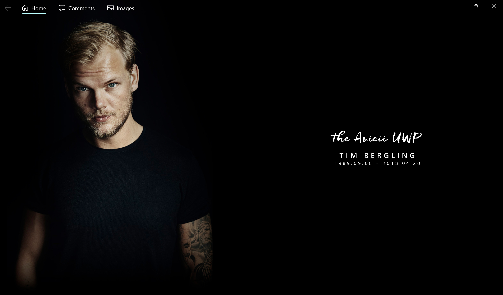
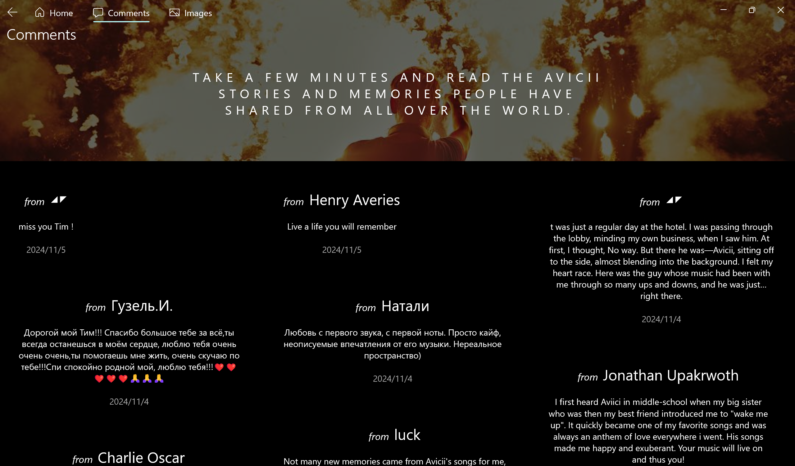

  
  <h1 align="center">Avicii.UWP</h1>

  A client for Avicii.com

  

>
>
>
>
>

### About Avicii
Tim Bergling (8 September 1989 – 20 April 2018), better known by his stage name Avicii, was a Swedish DJ, remixer, record producer, musician, and songwriter who specialized in audio programming, remixing, and record producing.
Information from [WIKIPEDIA](https://en.wikipedia.org/wiki/Avicii).

## Support
### Installation
For sideloaded packages, more info [here](https://docs.microsoft.com/en-us/windows/application-management/sideload-apps-in-windows-10).

### Version Requirement
- Windows 10 Mobile (ARM) : (10.0; version 15063)
- [Windows 10 Desktop](https://www.microsoft.com/en-us/software-download/windows10) (ARM64, x64, x32) : 1709 (10.0; version 16299) or higher
- [Visual Studio](https://visualstudio.microsoft.com/downloads/) with UWP : Version 2022
- [SDK](https://developer.microsoft.com/en-us/windows/downloads/sdk-archive/) : Windows 11 SDK (10.0.22621.0)
  - Can be installed in the Visual Studio Installer as well.